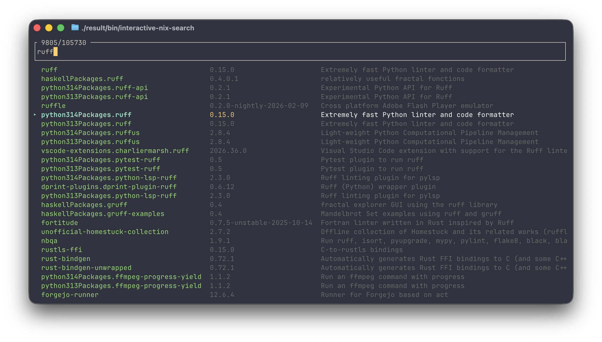

# interactive-nix-search



Interactive fuzzy finder for Nix packages. Searches any flake (defaults to `nixpkgs`) and supports multi-token,
out-of-order matching against package name, version, package set, and description. Search results are cached to
`~/.cache/interactive-nix-search/` with a 24-hour TTL.

Built with [ratatui](https://github.com/ratatui/ratatui) and [nucleo](https://github.com/helix-editor/nucleo).

## Quick Start

### Installation

#### nix profile

Try without installing:

```
nix run github:omarjatoi/interactive-nix-search
```

Add to your nix profile:

```
nix profile add github:omarjatoi/interactive-nix-search
```
#### nix flake

```nix
# flake.nix
{
  inputs.interactive-nix-search.url = "github:omarjatoi/interactive-nix-search";
}
```

```nix
# NixOS
environment.systemPackages = [
  inputs.interactive-nix-search.packages.${system}.default
];

# home-manager
home.packages = [
  inputs.interactive-nix-search.packages.${system}.default
];
```

#### Build from source:

```
nix build
```
or
```
cargo build --release
```

## Usage

```
interactive-nix-search [OPTIONS]
```

| Option | Description |
|---|---|
| `--height <N>` | Height of the inline viewport in rows (default: 40) |
| `-f`, `--full` | Fullscreen mode (uses alternate screen buffer) |
| `--flake <FLAKE>` | Flake to search (default: `nixpkgs`) |
| `-a`, `--add` | Install the selected package via `nix profile add` |

The selected package name is printed to stdout on enter, making it composable:

```
nix shell nixpkgs#$(interactive-nix-search)
```

## Keybindings

| Key | Action |
|---|---|
| `Enter` | Select package |
| `Esc` / `Ctrl-c` | Quit |
| `Ctrl-n` / `Ctrl-p` | Navigate results down / up |
| `Ctrl-a` / `Ctrl-e` | Move cursor to start / end of input |
| `Ctrl-b` / `Ctrl-f` | Move cursor back / forward one character |
| `Ctrl-u` / `Ctrl-k` | Delete to start / end of input |
| `Ctrl-d` | Delete character at cursor |


## License

Copyright © 2026 Omar Jatoi

Licensed under the Apache License, Version 2.0 (the "License");
you may not use this file except in compliance with the License.
You may obtain a copy of the License at

    http://www.apache.org/licenses/LICENSE-2.0

Unless required by applicable law or agreed to in writing, software
distributed under the License is distributed on an "AS IS" BASIS,
WITHOUT WARRANTIES OR CONDITIONS OF ANY KIND, either express or implied.
See the License for the specific language governing permissions and
limitations under the License.
